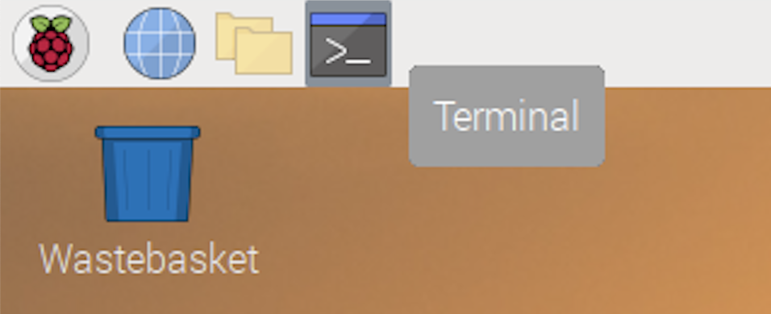

# Node Configuration Parameters

Presearch nodes run as docker containers, with configuration options being passed in as environmental variables using the `-e PARAM1=VALUE1 -e PARAM2=VALUE2` format.

When starting your node for the first time, the only required parameter is the node's REGISTRATION\_CODE. We recommend running the full node setup command in the [Node Setup Instructions](setup.md) for your particular operating system, as this will also install the auto-updater and will make maintenance much easier. On this page, we will only highlight the specific part of the command that contains the node configuration parameters:


```bash
...
docker run -dt --name presearch-node --restart=unless-stopped -v presearch-node-storage:/app/node -e REGISTRATION_CODE=$YOUR_REGISTRATION_CODE_HERE presearch/node
...
```


If you also wanted to add a description to your node or a stake when first creating it, you would just add those additional configuration parameters. If your value has a space or special character, please wrap it with `"` characters (double quote):


```bash
...
docker run -dt --name presearch-node --restart=unless-stopped -v presearch-node-storage:/app/node -e REGISTRATION_CODE=$YOUR_REGISTRATION_CODE_HERE -e DESCRIPTION="My First Node" -e STAKE=10000 presearch/node
...
```


### List of Available Configuration Parameters

| Key                                         |                                                                                                                                                                                                                                                                                                                                                                                                                                                                                                                                                                                                                                                                                                                                                                                                                                                                                                                                                                                                                                                                                                                                                                                                                                                                                                                                                                                                        |
| ------------------------------------------- | ------------------------------------------------------------------------------------------------------------------------------------------------------------------------------------------------------------------------------------------------------------------------------------------------------------------------------------------------------------------------------------------------------------------------------------------------------------------------------------------------------------------------------------------------------------------------------------------------------------------------------------------------------------------------------------------------------------------------------------------------------------------------------------------------------------------------------------------------------------------------------------------------------------------------------------------------------------------------------------------------------------------------------------------------------------------------------------------------------------------------------------------------------------------------------------------------------------------------------------------------------------------------------------------------------------------------------------------------------------------------------------------------------ |
| REGISTRATION\_CODE                          | <p>Required the first time you start your node. This node registration code allows your node to associate its identity (public key) with your registered Presearch account. You can obtain or change your registration code at any time at on the <a href="https://nodes.presearch.com/dashboard">nodes dashboard</a>. <br><br>The registration code is ONLY required the first time you start your node, and changing the registration code will not affect any previously-connected nodes.<br><br>ex:<br><code>-e REGISTRATION_CODE=XXXXXXXX</code></p>                                                                                                                                                                                                                                                                                                                                                                                                                                                                                                                                                                                                                                                                                                                                                                                                                                              |
| DESCRIPTION                                 | <p>Allows you to optionally pass in a description of your node that will show up in your nodes dashboard to help you identify the node. This description will reset every time you restart your node.<br><br>ex:<br><code>-e URL="My Home Computer"</code></p>                                                                                                                                                                                                                                                                                                                                                                                                                                                                                                                                                                                                                                                                                                                                                                                                                                                                                                                                                                                                                                                                                                                                         |
| URL                                         | <p>Allows you to optionally pass in a link to a third-party website that will show up in your nodes dashboard with your node's description. This will often be used to link to a third-party hosting provider's dashboard information about your node for convenient access from your node dashboard. This url will reset every time you start your node.<br><br>ex:<br>-e URL="https://myhostingprovider.com/servers/12345"</p>                                                                                                                                                                                                                                                                                                                                                                                                                                                                                                                                                                                                                                                                                                                                                                                                                                                                                                                                                                       |
| STAKE                                       | <p>The stake specifies the number of PRE tokens you wish to stake on your node. The stake can ONLY be set by this parameter the FIRST time your node connects to the network and registers with the REGISTRATION_CODE. The stake parameter will be ignored after the first connection. Any subsequent changes to your node's stake must be made on the <a href="https://nodes.presearch.com/dashboard">node dashboard</a>.<br><br>Stakes can be specified as as an exact number of tokens to pull from your PRE Wallet (i.e. <code>10000</code> or the equivalent <code>wallet:10000</code>), a relative number (i.e. <code>wallet:minimum</code> or <code>wallet:maximum</code>), or as the metadata of a specific other node to pull the stake from (i.e. <code>disconnected:oldest</code>, <code>disconnected:longest</code>, <code>disconnected:oldest#flux</code>).<br><br>Multiple conditional stake rules can also be separated by a comma, such that later rules only execute if previous rules fail. I all stake rules fail, then no stake will be applied on your newly-launched node.<br><br>ex:<br><code>-e STAKE=10000</code> (shorthand for <code>STAKE=wallet:10000</code>)<br><code>-e STAKE=wallet:minimum</code><br><code>-e STAKE=disconnected:oldest</code><br><code>-e STAKE=disconnected:oldest#flux</code><br><code>-e STAKE=disconnected:oldest#flux,wallet:minimum</code></p> |
| TAGS                                        | <p>Tags can be specified to label your nodes for specific uses, such as which nodes can have their stakes recovered to other nodes.<br><br>ex:<br><code>-e TAGS=flux,some_other_tag</code></p>                                                                                                                                                                                                                                                                                                                                                                                                                                                                                                                                                                                                                                                                                                                                                                                                                                                                                                                                                                                                                                                                                                                                                                                                         |
| ALLOW\_DISCONNECTED\_STAKE\_TRANSFER\_AFTER | <p>Specifies a default amount of time after which a node is considered "disconnected" and another node could take over the stake and begin using it. The default value is "0", meaning if a node is disconnected then another node can immediately steal the stake. This is helpful if you lose access to a node without backing up the private key, but can also lead to stakes unexpectedly migrating from one node to another if you used the <code>STAKE=disconnected:...</code> parameters without specifying a reasonable <code>ALLOW_DISCONNECTED_STAKE_TRANSFER_AFTER</code> value.<br><br>ex:<br><code>-e ALLOW_DISCONNECTED_STAKE_TRANSFER_AFTER=10000</code>(defaults to milliseconds, so 10 seconds here)<br><code>-e ALLOW_DISCONNECTED_STAKE_TRANSFER_AFTER=5000s (5000 seconds)</code><br><code>-e ALLOW_DISCONNECTED_STAKE_TRANSFER_AFTER=30m (30 minutes)</code><br><code>-e ALLOW_DISCONNECTED_STAKE_TRANSFER_AFTER=7d (7 days)</code></p>                                                                                                                                                                                                                                                                                                                                                                                                                                           |

By allowing you to programmatically specify configuration parameters when starting your node, this enables tremendous flexibility for you to provide dynamic metadata into the descriptions and urls for your nodes, transfer private keys between servers, and have simple and fine-grained control over the transfer of stakes from lost nodes to brand new nodes if ever needed.\
\
As an example of how one might dynamically specify values (using an AWS EC2 node):


```bash
docker run -dt --name presearch-node -e DESCRIPTION="AWS:[$(ec2metadata --instance-id), $(ec2metadata --availability-zone), $(ec2metadata --public-ipv4)]" -e URL="https://$(ec2metadata --availability-zone | sed 's/.$//').console.aws.amazon.com/ec2/v2/home?region=$(ec2metadata --availability-zone | sed 's/.$//')#InstanceDetails:instanceId=$(ec2metadata --instance-id)" -e REGISTRATION_CODE="XXXXXXXXXXXXXXXXXXXXXXXXXXXXXXXX" presearch/node
```


**Outcome:**

<figure><figcaption></figcaption></figure>

In addition to the Presearch node configuration parameters above, since Presearch nodes run as Docker containers, this means that you have full flexibility to also use and Docker configuration parameters to optimize the running of your Presearch node, as well. The default installation commands contain recommended parameters for seamless out-of-the-box use. Some of the most commonly-used Docker parameters by node operators include:\
`--detach`, `-d` (Part of installation/run command)\
`--name`, `-n` (Part of installation/run command)\
`--volume`, `-v` (Part of installation/run command)\
`--interactive`, `-i` (Part of installation command)\
`--tty`, `-t` (Part of installation command)\
`--restart-unless-stopped` (Part of installation command)\
\
`--network`: can be used to optimize network speed / latency depending on your internet setup\
`--dns`: can override your computer's default DNS configuration to avoid bad DNS providers. If you're getting errors about being unable to connect to reach the network then a bad DNS provider is the most common reason.\
`--ip`: can be used to select from different available IP addresses if your system has multiple\
\
Please consult the [Docker documentation](https://docs.docker.com/engine/reference/run/) if you would like to better understand these and other available container configuration parameters.\
