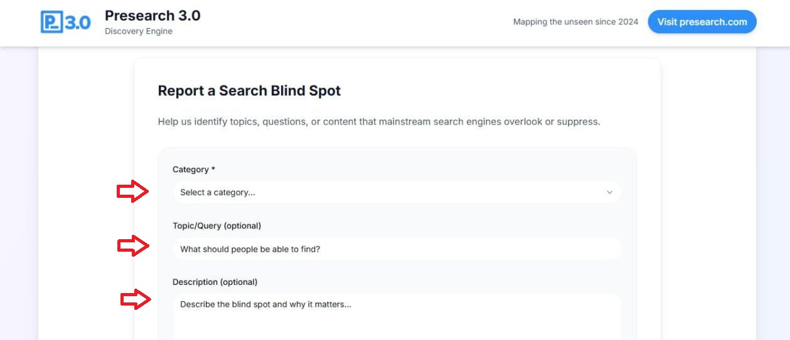
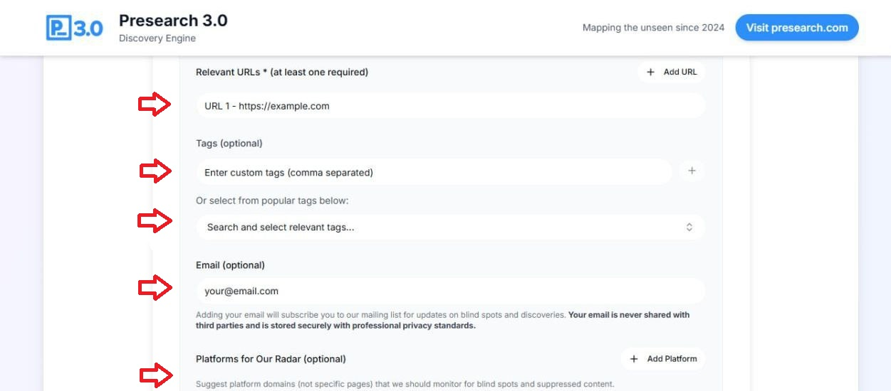
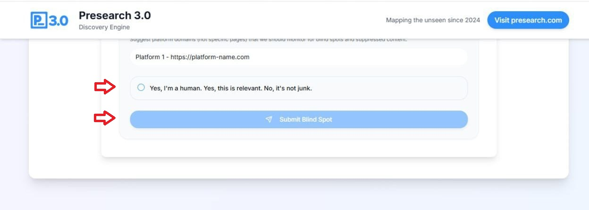

# Map the Blind Spots

&#x20;Only about 10% of the web is truly visible. The other 90%—filled with valuable, overlooked, and often human-driven knowledge—remains buried or undiscoverable. That's the gold we're mining.

&#x20;This mini-site is where you come in. With Blind Spot Mapping and Self-Indexing, you can:

* • **Identify blind spots:** Help us surface topics, creators, and content that mainstream engines bury or ignore.
* • **Submit your own content:** If you're a creator, researcher, or community builder, index yourself directly and become discoverable without gatekeepers.

Together, we're building a Frontier Intelligence Search Stack: a decentralized, creator-centric index designed to serve content that Big Tech overlooks.

**What We're Building**

🔑**Differentiated Results:** Surfacing underserved, unbiased, human-centric content — Frontier Intelligence. Think all the stuff that's hard to find on Google.

🔑**Engagement Platform:** Not passive. Users search, learn, earn, advertise, stay anonymous, and debate freely.

🔑**Native Social Layer:** Real-time, anonymous discussion integrated right into search.

🔑**Customizable Search:** Slide left → fringe, independent, alternative. Slide right → mainstream, commercial.

🔑**Precision Search, Site-Specific:** Dedicated tabs (Alt News, Creators, Research, etc.) with platform-specific dropdowns. Frontier search as a federation of niche engines.

🔑**Sustainable Model:** A diversified revenue flywheel: open-sourced step by step, crypto-native incentives, and community-aligned growth that Big Tech had to buy but we can bootstrap.

By mapping blind spots and championing balanced, creator-driven content, Presearch is becoming the discovery tool people want to share—a search engine built for the open web, not against it.

&#x20;Here you can see an example of the form where you can enter the required information according to the unattended points on the Internet.

<figure><figcaption></figcaption></figure>

<figure><figcaption></figcaption></figure>

<figure><figcaption></figcaption></figure>

**Help us identify topics, questions, or content that mainstream search engines overlook or suppress.**



\
\
