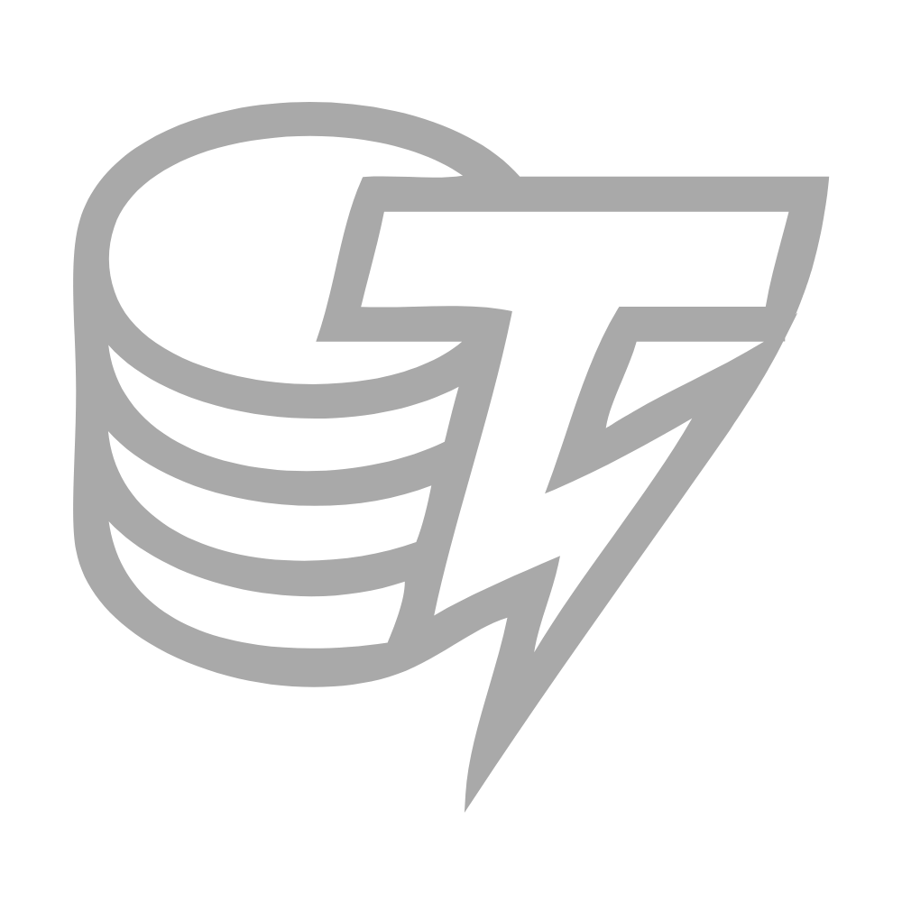
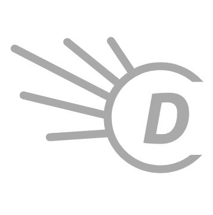
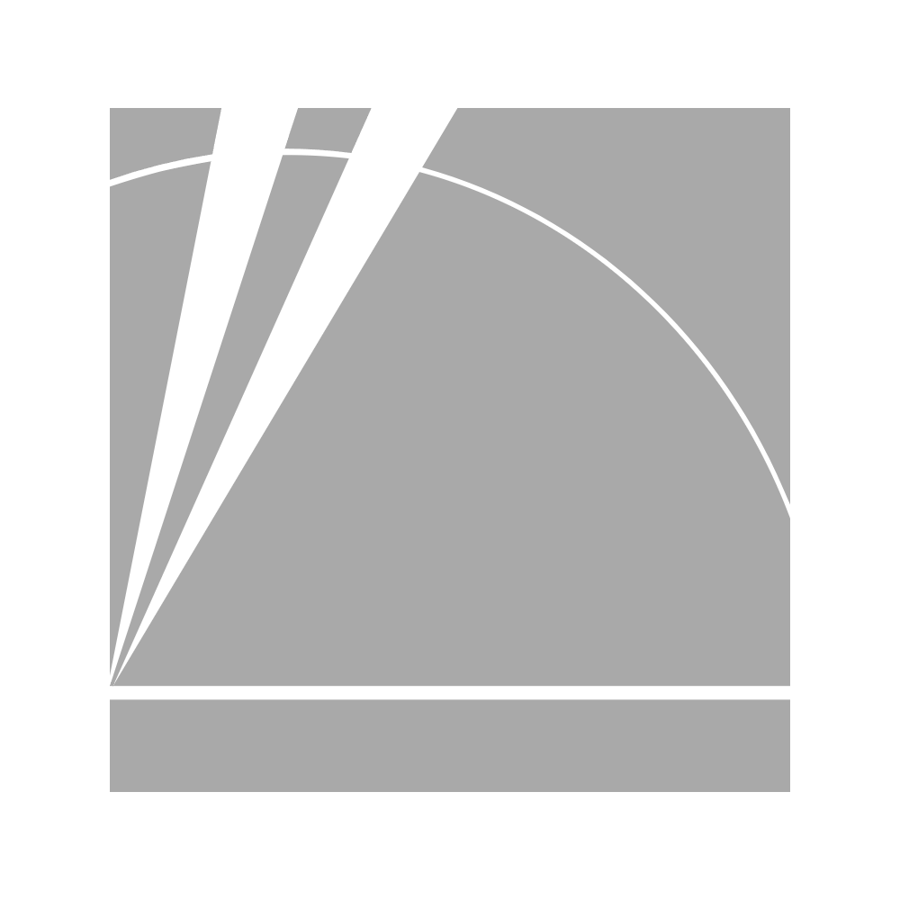
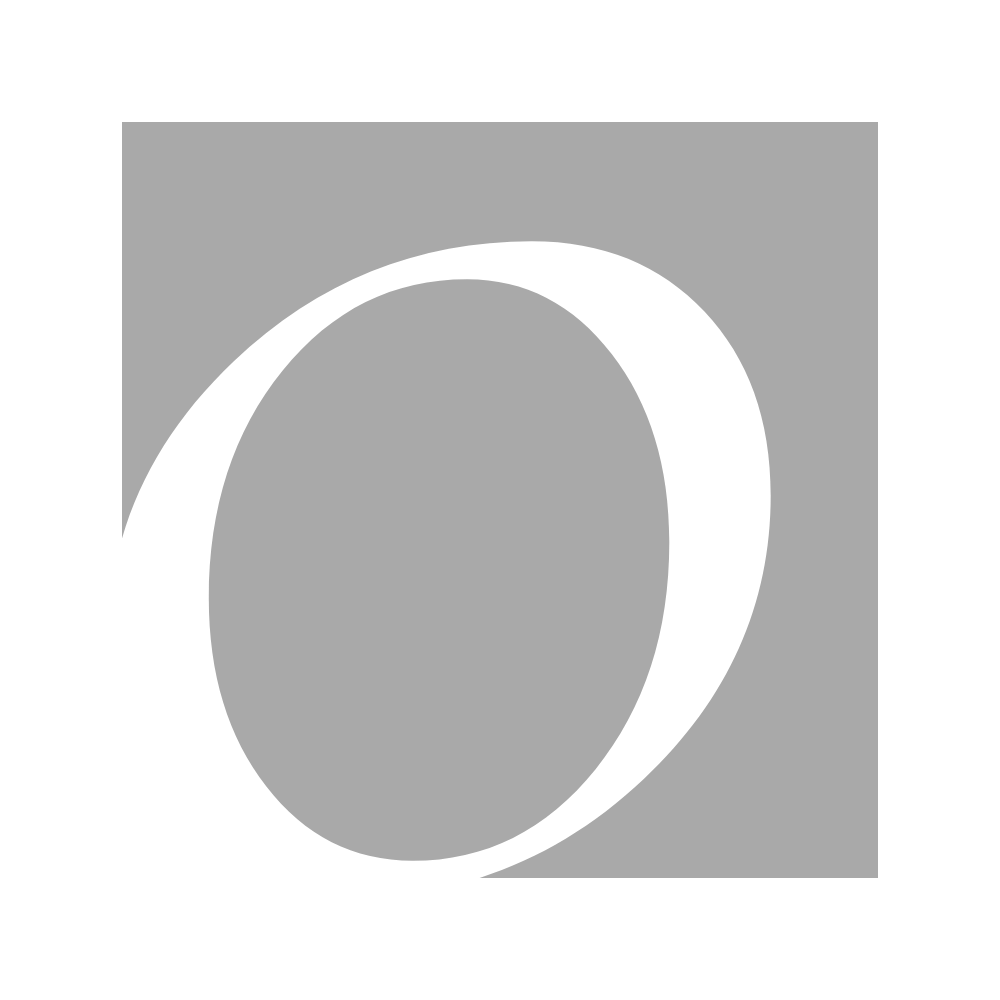
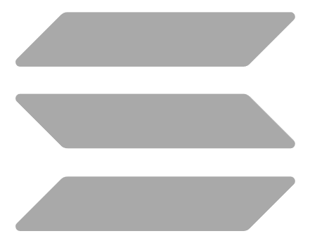
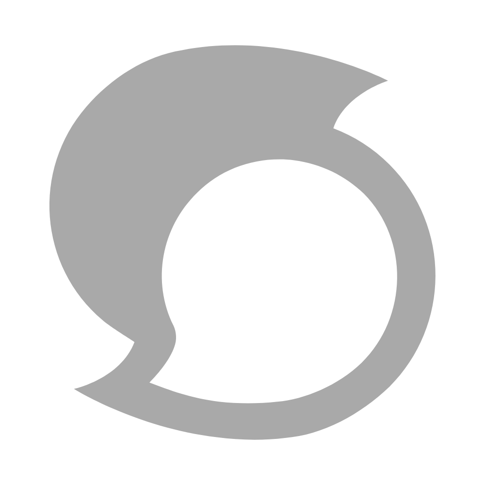

# MetaSearch

<table data-view="cards"><thead><tr><th align="center"></th><th></th><th data-type="content-ref"></th><th data-card-cover data-type="files"></th></tr></thead><tbody><tr><td align="center"></td><td><strong>Amazon Brasil,Canada,Deutschland,España,France,India,Italia,Mexico,Nederland,UAE,UK,Australia,Turkie</strong>                     </td><td></td><td></td></tr><tr><td align="center"></td><td>        <strong>All Music</strong></td><td></td><td></td></tr><tr><td align="center"></td><td>       <strong>Archive.org</strong></td><td></td><td></td></tr><tr><td align="center"></td><td>         <strong>AZLyrics</strong></td><td></td><td></td></tr><tr><td align="center"></td><td>           <strong>Baidu</strong></td><td></td><td></td></tr><tr><td align="center"></td><td>            <strong>BBC</strong></td><td></td><td></td></tr><tr><td align="center"></td><td>            <strong>Bing</strong></td><td></td><td></td></tr><tr><td align="center"></td><td>   <strong>Bleacher Report</strong></td><td></td><td></td></tr><tr><td align="center"></td><td>       <strong>Blockchain</strong></td><td></td><td></td></tr><tr><td align="center"></td><td>         <strong>Blockchair</strong></td><td></td><td></td></tr><tr><td align="center"></td><td>

      <strong>Booking.com</strong>
</td><td></td><td></td></tr><tr><td align="center"></td><td>

          <strong>BscScan</strong>
</td><td></td><td></td></tr><tr><td align="center"></td><td>   <strong>Business Insider</strong></td><td></td><td></td></tr><tr><td align="center"></td><td>            <strong>CBC</strong></td><td></td><td></td></tr><tr><td align="center"></td><td>            <strong>CNN</strong></td><td></td><td></td></tr><tr><td align="center"></td><td>       <strong>CNN Money</strong></td><td></td><td></td></tr><tr><td align="center"></td><td>         <strong>CodePen</strong></td><td></td><td></td></tr><tr><td align="center"></td><td>  <strong>Coin Telegraph</strong></td><td></td><td></td></tr><tr><td align="center"></td><td>        <strong>CoinDesk</strong></td><td></td><td></td></tr><tr><td align="center"></td><td>      <strong>CoinGecko</strong></td><td></td><td></td></tr><tr><td align="center"></td><td>   <strong>CoinMarketCap</strong></td><td></td><td></td></tr><tr><td align="center"></td><td>    <strong>Dictionary.com</strong></td><td></td><td></td></tr><tr><td align="center"></td><td>   <strong>Domain Market</strong></td><td></td><td></td></tr><tr><td align="center"></td><td>    <strong>DomainTools</strong></td><td></td><td></td></tr><tr><td align="center"></td><td>         <strong>Dribbble</strong></td><td></td><td></td></tr><tr><td align="center"></td><td>         <strong>Dsearch</strong></td><td></td><td></td></tr><tr><td align="center"></td><td>         <strong>DTube</strong></td><td></td><td></td></tr><tr><td align="center"></td><td>     <strong>DuckDuckGo</strong></td><td></td><td></td></tr><tr><td align="center"></td><td>           <strong>Dwell</strong></td><td></td><td></td></tr><tr><td align="center"></td><td>            <strong>eBay</strong></td><td></td><td></td></tr><tr><td align="center"></td><td>          <strong>Ecosia</strong></td><td></td><td></td></tr><tr><td align="center"></td><td>           <strong>ESPN</strong></td><td></td><td></td></tr><tr><td align="center"></td><td>        <strong>Etherscan</strong></td><td></td><td></td></tr><tr><td align="center"></td><td>             <strong>Etsi</strong></td><td></td><td></td></tr><tr><td align="center"></td><td>

         <strong>Everipedia</strong>
</td><td></td><td></td></tr><tr><td align="center"></td><td>        <strong>Facebook</strong></td><td></td><td></td></tr><tr><td align="center"></td><td>           <strong>Flote</strong></td><td></td><td></td></tr><tr><td align="center"></td><td>          <strong>Forbes</strong></td><td></td><td></td></tr><tr><td align="center"></td><td>        <strong>Fox News</strong></td><td></td><td></td></tr><tr><td align="center">

<strong>Freespoke</strong>
</td><td></td><td></td><td></td></tr><tr><td align="center"></td><td>           <strong>Giphy</strong></td><td></td><td></td></tr><tr><td align="center"></td><td>          <strong>Github</strong></td><td></td><td></td></tr><tr><td align="center"></td><td>         <strong>GoDaddy</strong></td><td></td><td></td></tr><tr><td align="center"></td><td><strong>Google, southKorea,Brasil,Canada,China,Deutschland,France,Mexico,Pakistan,Polska,Puertorico,Šrilanka,Venezuela,Rusia</strong></td><td></td><td></td></tr><tr><td align="center"></td><td>      <strong>Google Drive</strong></td><td></td><td></td></tr><tr><td align="center"></td><td>    <strong>Google Finance</strong></td><td></td><td></td></tr><tr><td align="center"></td><td>    <strong>Google Images</strong></td><td></td><td></td></tr><tr><td align="center"></td><td>       <strong>Google Maps</strong></td><td></td><td></td></tr><tr><td align="center"></td><td><strong>Google Play Music</strong></td><td></td><td></td></tr><tr><td align="center"></td><td>         <strong>Hacked</strong></td><td></td><td></td></tr><tr><td align="center"></td><td>     <strong>Hacker News</strong></td><td></td><td></td></tr><tr><td align="center"></td><td>      <strong>Home Depot</strong></td><td></td><td></td></tr><tr><td align="center"></td><td>          <strong>Houzz</strong></td><td></td><td></td></tr><tr><td align="center"></td><td>    <strong>Huge Domains</strong></td><td></td><td></td></tr><tr><td align="center"></td><td>            <strong>Ikea</strong></td><td></td><td></td></tr><tr><td align="center"></td><td>           <strong>IMDB</strong></td><td></td><td></td></tr><tr><td align="center"></td><td>            <strong>Imgur</strong></td><td></td><td></td></tr><tr><td align="center"></td><td>        <strong>Instagram</strong></td><td></td><td></td></tr><tr><td align="center"></td><td><strong>Int'l Business Times</strong></td><td></td><td></td></tr><tr><td align="center"></td><td>

          <strong>Intellicast</strong>
</td><td></td><td></td></tr><tr><td align="center"></td><td>      <strong>Investopedia</strong></td><td></td><td></td></tr><tr><td align="center"></td><td>

            <strong>iStock</strong>
</td><td></td><td></td></tr><tr><td align="center"></td><td>          <strong>iTunes</strong></td><td></td><td></td></tr><tr><td align="center"></td><td><strong>Kadena Block     Explorer</strong></td><td></td><td></td></tr><tr><td align="center"></td><td>         <strong>Kohl's</strong></td><td></td><td></td></tr><tr><td align="center"></td><td>         <strong>Last.fm</strong></td><td></td><td></td></tr><tr><td align="center"></td><td>        <strong>LinkedIn</strong></td><td></td><td></td></tr><tr><td align="center"></td><td>        <strong>Medium</strong></td><td></td><td></td></tr><tr><td align="center"></td><td>           <strong>Minds</strong></td><td></td><td></td></tr><tr><td align="center"></td><td>        <strong>Mintscan</strong></td><td></td><td></td></tr><tr><td align="center"></td><td>    <strong>Monero Blocks</strong></td><td></td><td></td></tr><tr><td align="center"></td><td>    <strong>National Post</strong></td><td></td><td></td></tr><tr><td align="center"></td><td>           <strong>Netflix</strong></td><td></td><td></td></tr><tr><td align="center"></td><td>

           <strong>Odysee</strong>
</td><td></td><td></td></tr><tr><td align="center"></td><td>

          <strong>OpenSea</strong>
</td><td></td><td></td></tr><tr><td align="center"></td><td>       <strong>Overstock</strong></td><td></td><td></td></tr><tr><td align="center"></td><td>          <strong>Pexels</strong></td><td></td><td></td></tr><tr><td align="center"></td><td>        <strong>Pinterest</strong></td><td></td><td></td></tr><tr><td align="center"></td><td>           <strong>Plumb</strong></td><td></td><td></td></tr><tr><td align="center"></td><td>

      <strong>Polygonscan</strong>
</td><td></td><td></td></tr><tr><td align="center">

<strong>Publish0x</strong>
</td><td></td><td></td><td></td></tr><tr><td align="center"></td><td>  <strong>Presearch engine</strong></td><td></td><td></td></tr><tr><td align="center"></td><td><strong>Presearch engine (Tesnet)</strong></td><td></td><td></td></tr><tr><td align="center"></td><td>          <strong>Purse.io</strong></td><td></td><td></td></tr><tr><td align="center"></td><td>           <strong>Quora</strong></td><td></td><td></td></tr><tr><td align="center"></td><td>           <strong>Qwant</strong></td><td></td><td></td></tr><tr><td align="center"></td><td>           <strong>Reddit</strong></td><td></td><td></td></tr><tr><td align="center"></td><td>  <strong>Rotten Tomatoes</strong></td><td></td><td></td></tr><tr><td align="center"></td><td>           <strong>Sedo</strong></td><td></td><td></td></tr><tr><td align="center"></td><td>    <strong>Seeking Alpha</strong></td><td></td><td></td></tr><tr><td align="center"></td><td>      <strong>Sky Sports</strong></td><td></td><td></td></tr><tr><td align="center"></td><td>

      <strong>Solanascan</strong>
</td><td></td><td></td></tr><tr><td align="center"></td><td>     <strong>SoundCloud</strong></td><td></td><td></td></tr><tr><td align="center"></td><td>     <strong>SourceForge</strong></td><td></td><td></td></tr><tr><td align="center"></td><td> <strong>Sports Illustrated</strong></td><td></td><td></td></tr><tr><td align="center"></td><td>          <strong>Spotify</strong></td><td></td><td></td></tr><tr><td align="center"></td><td>   <strong>Stack Exchange</strong></td><td></td><td></td></tr><tr><td align="center"></td><td>   <strong>Stack Overflow</strong></td><td></td><td></td></tr><tr><td align="center"></td><td>         <strong>Steemit</strong></td><td></td><td></td></tr><tr><td align="center"></td><td>          <strong>Target</strong></td><td></td><td></td></tr><tr><td align="center"></td><td><strong>The Weather                                 Network</strong></td><td></td><td></td></tr><tr><td align="center"></td><td>   <strong>Thesaurus.com</strong></td><td></td><td></td></tr><tr><td align="center"></td><td>       <strong>Tronscan</strong></td><td></td><td></td></tr><tr><td align="center"></td><td>          <strong>Tumblr</strong></td><td></td><td></td></tr><tr><td align="center"></td><td>         <strong>Tunein</strong></td><td></td><td></td></tr><tr><td align="center">

<strong>X (Twitter)</strong>
</td><td></td><td></td><td></td></tr><tr><td align="center"></td><td>       <strong>Uptrennd</strong></td><td></td><td></td></tr><tr><td align="center"></td><td>        <strong>Wikipedia</strong></td><td></td><td></td></tr><tr><td align="center"></td><td>        <strong>XCHscan</strong></td><td></td><td></td></tr><tr><td align="center"></td><td>     <strong>Yahoo Finance</strong></td><td></td><td></td></tr><tr><td align="center"></td><td>         <strong>Yandex</strong></td><td></td><td></td></tr><tr><td align="center"></td><td>             <strong>Yelp</strong></td><td></td><td></td></tr><tr><td align="center"></td><td>          <strong>Youtube</strong></td><td></td><td></td></tr><tr><td align="center"></td><td>       <strong>ZeroHedge</strong></td><td></td><td></td></tr></tbody></table>

