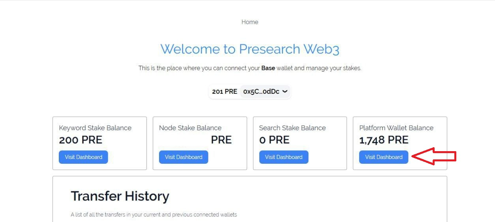
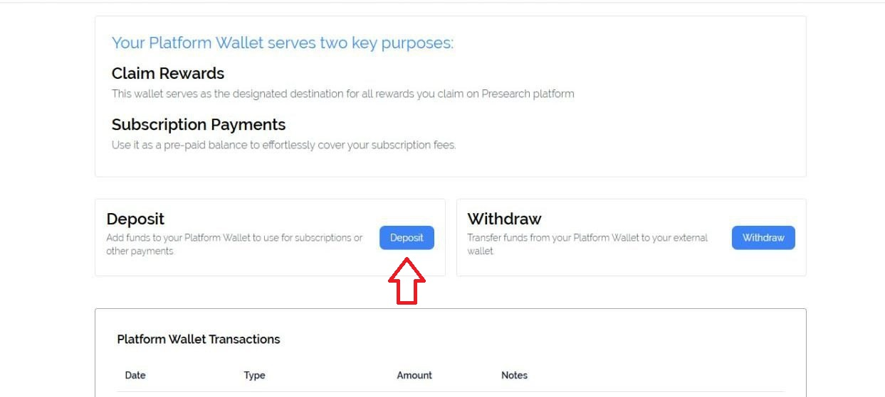
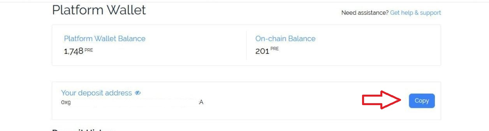
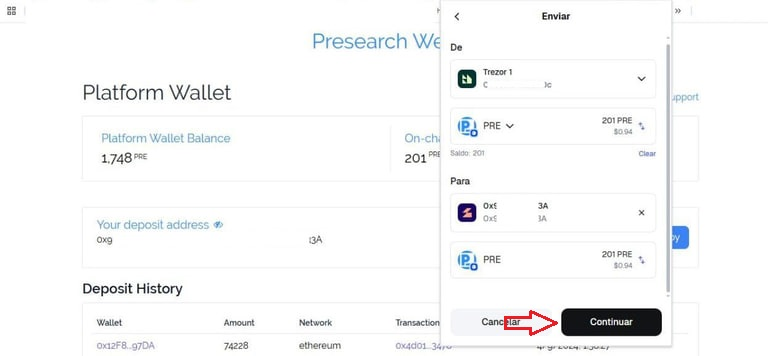
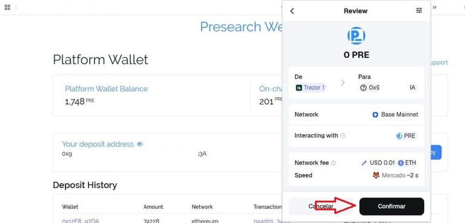
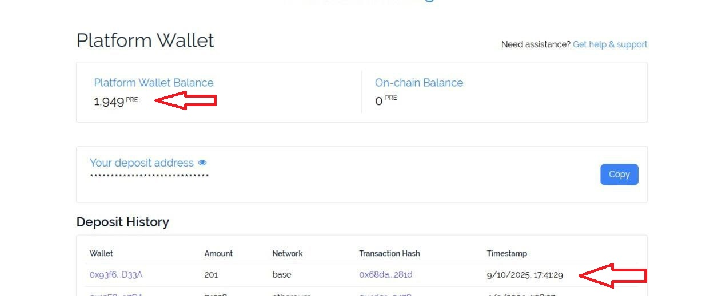

# How to Deposit Tokens onto the Presearch Web3 Platform

1. Log in to your [presearch account](https://presearch.com/), you follow the tutorial here: [Presearch Web3 Login](presearch-web3-login.md)
2. Enter your account menu: [My Account](https://account.presearch.com/) and click on Web3 dashboard.

<figure><figcaption></figcaption></figure>

3. Click on Visit Dashboard within the Platform Wallet Balance.

<figure><figcaption></figcaption></figure>

4. Click on deposit and then copy the deposit address.

<figure><figcaption></figcaption></figure>

<figure><figcaption></figcaption></figure>

5. Open your external wallet, select PRE, send, and enter your presearch account address, then confirm the transaction.

<figure><figcaption></figcaption></figure>

<figure><figcaption></figcaption></figure>

6. You will be able to see your deposit within the platform wallet and you will also be able to monitor it in the deposit history.&#x20;

<figure><figcaption></figcaption></figure>

### Youtube link 

Unlock Your Presearch Rewards | How to Deposit Tokens onto the Presearch Platform



\

\

\

\
