# How to Keyword Stake on Presearch Web3

1. Log in to your [presearch account](https://presearch.com/), you can follow the tutorial here: [Presearch Web3 Login](presearch-web3-login.md)
2. Enter your account menu: [My Account](https://account.presearch.com/) and click on Web3 dashboard.

<figure><figcaption></figcaption></figure>

3. Click on Visit Dashboard within **Keyword Stake Balance.**

<figure>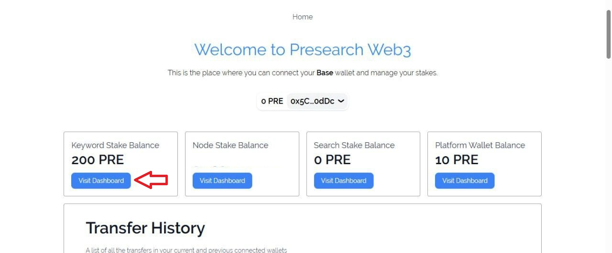<figcaption></figcaption></figure>

4. In the search bar, enter the keyword you want to stake.&#x20;

<figure>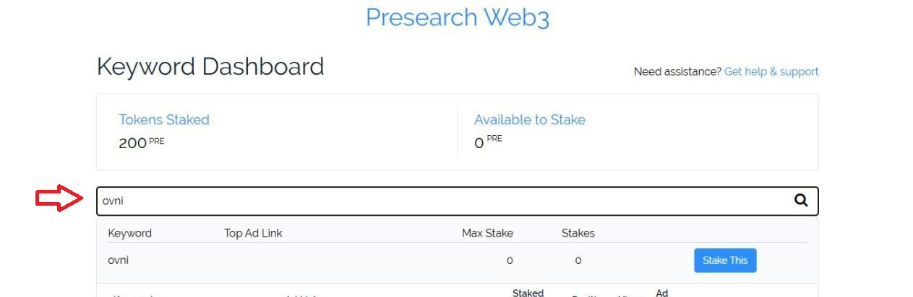<figcaption></figcaption></figure>

5. Click on Stake This.

<figure>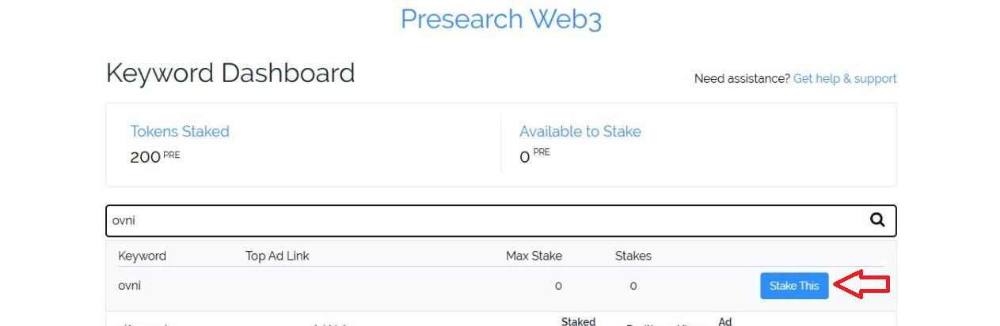<figcaption></figcaption></figure>

6. Enter the requested information in the **¨Create Keyword section¨** and click Create Keyword.

<figure><figcaption></figcaption></figure>

7. Enter the amount of Pre staked and click Update Stake, It is worth mentioning that the minimum stake amount is 100 PRE per keyword.

* If no one has staked for that keyword, you'll see 0 **stakes**. Otherwise, you'll see that there's already a stake and you'll need to exceed the stake amount established for each keyword you want to win.
  \
  For example, if a keyword has a stake of 100 PRE, you'd need to place 200 PRE to win that keyword.

<figure>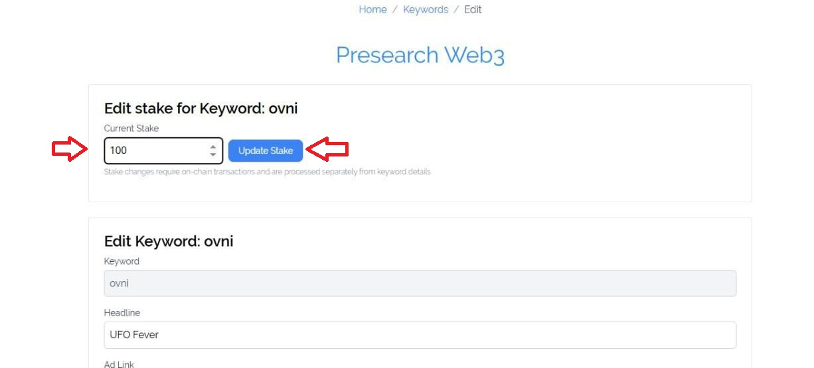<figcaption></figcaption></figure>

8. Click on Approve.

<figure>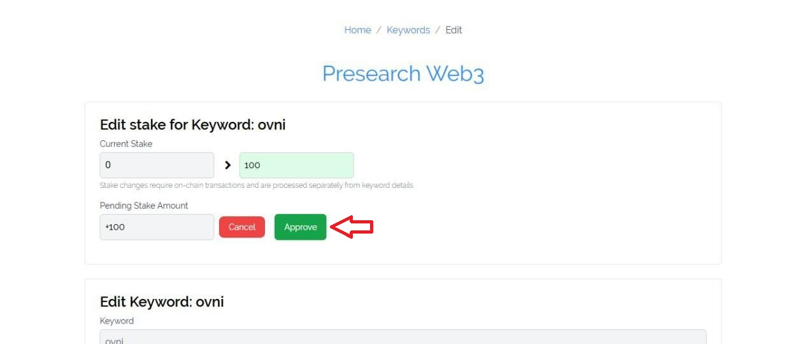<figcaption></figcaption></figure>

9. Confirm the transaction in your external wallet.

<figure>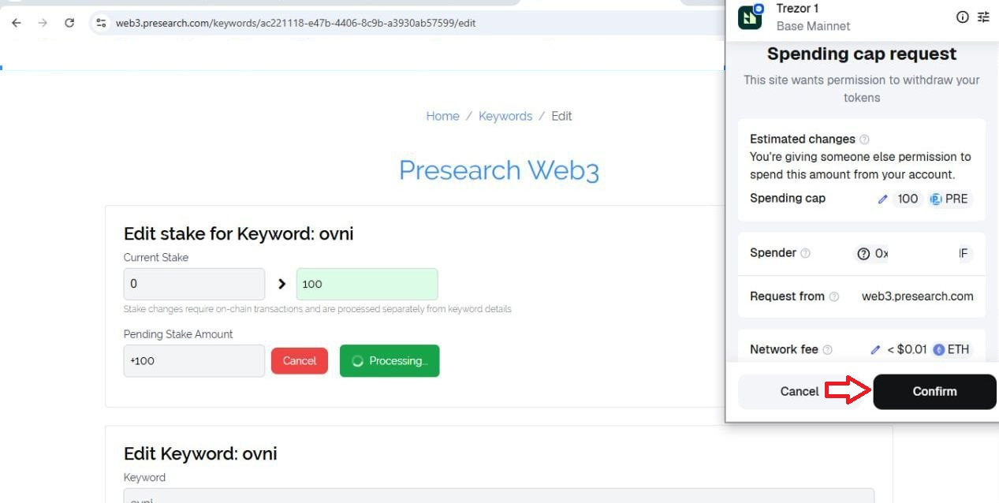<figcaption></figcaption></figure>

<figure>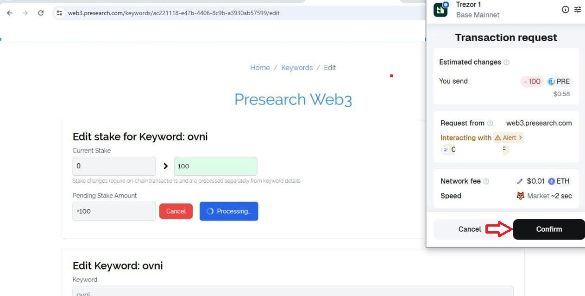<figcaption></figcaption></figure>

10. You can check your Pre-Stake amount for all your keywords in your ¨**Keyword Dashboard¨**, manage your keywords in ¨**Current Keywords¨**, and you can also check the transaction in your ¨**Transfer History¨.**

<figure>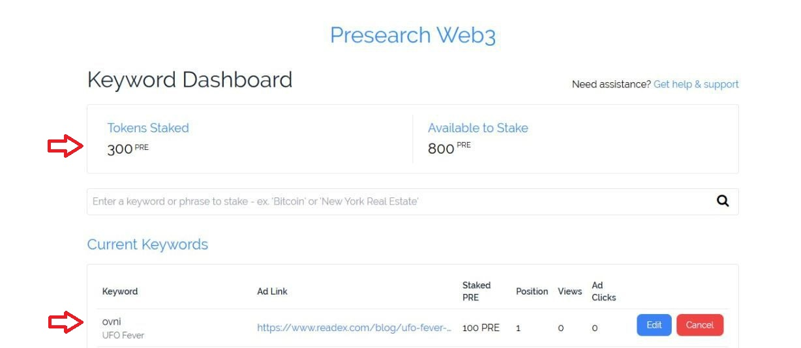<figcaption></figcaption></figure>

<figure>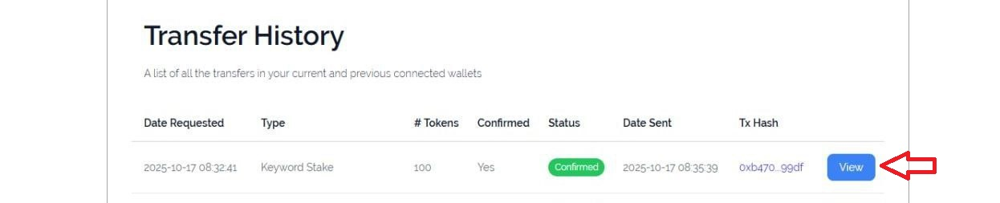<figcaption></figcaption></figure>

11. By entering your keyword into the search engine, you will be able to see your ad in the search results.

<figure>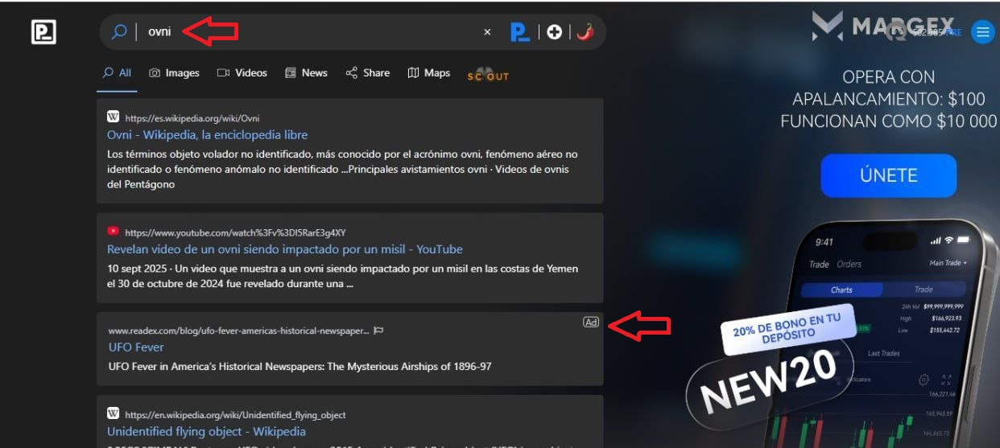<figcaption></figcaption></figure>

## Unstake Keyword Stake

1. On your web3 dashboard Click on Visit Dashboard within **Keyword Stake Balance.**

<figure><figcaption></figcaption></figure>

2. Click on cancel.

<figure>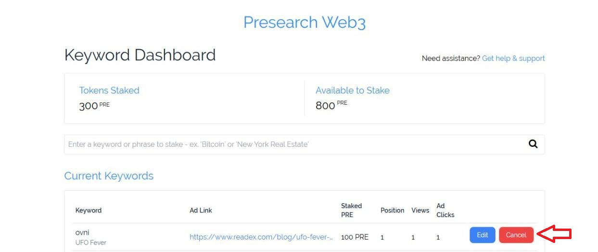<figcaption></figcaption></figure>

3. Click on Edit keyword.

<figure>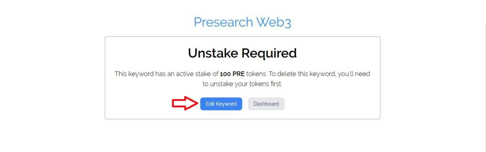<figcaption></figcaption></figure>

4. Set to 0 and click Update Stake.

<figure><figcaption></figcaption></figure>

5. Click on Unstake.

<figure><figcaption></figcaption></figure>

6. Confirm the transaction and you will have the tokens inside your external wallet.

<figure><figcaption></figcaption></figure>

7. You will be able to see that it has been successfully Unstake and you will also be able to see it in the transaction history.

<figure>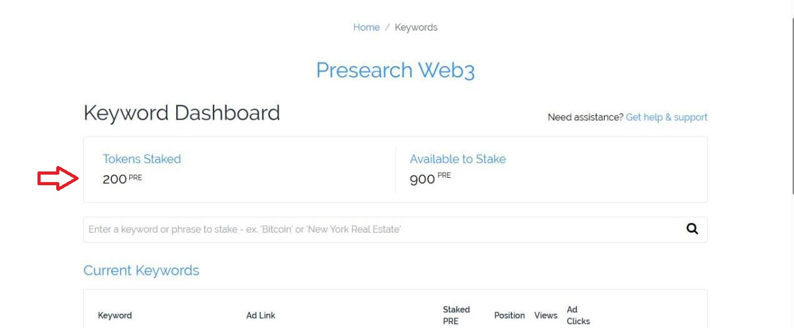<figcaption></figcaption></figure>

<figure>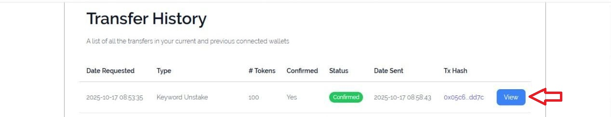<figcaption></figcaption></figure>

8. Go to **¨Current Keywords¨**, search for the keyword, and click on cancel.

<figure>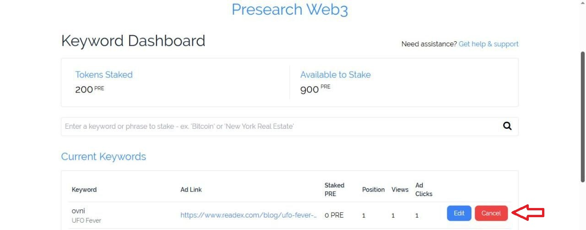<figcaption></figcaption></figure>

9. Finally, click on delete keyword.

<figure><figcaption></figcaption></figure>

 
