# How to Node Stake on Presearch Web3

1. Log in to your [presearch account](https://presearch.com/), you can follow the tutorial here: [Presearch Web3 Login](presearch-web3-login.md)
2. Enter your account menu: [My Account](https://account.presearch.com/) and click on Web3 dashboard.

<figure><figcaption></figcaption></figure>

3. Click on Visit Dashboard within **Node Stake Balance.**

<figure>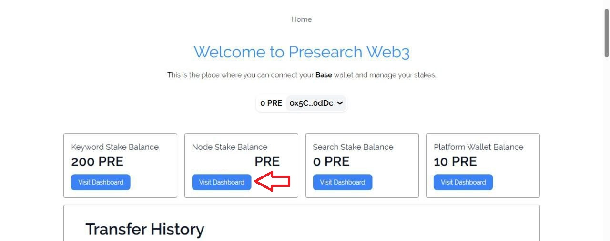<figcaption></figcaption></figure>

4. Scroll down to the **¨Current Nodes¨** section and click on stake.

<figure>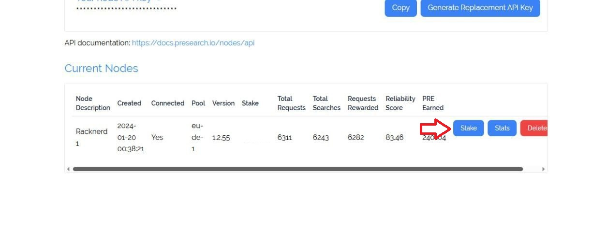<figcaption></figcaption></figure>

5. Enter the stake amount manually and click Update Stake.

<figure><figcaption></figcaption></figure>

6. Approve the transaction and then confirm it in your external wallet.

<figure>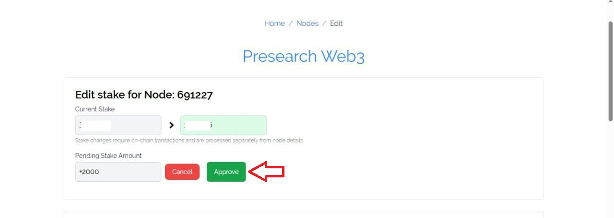<figcaption></figcaption></figure>

<figure>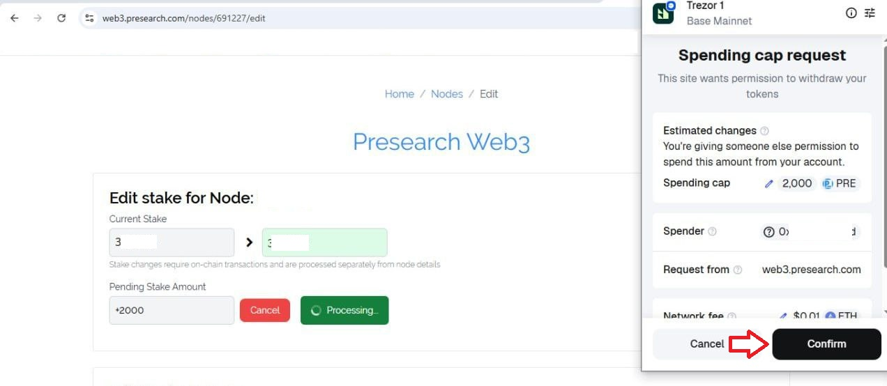<figcaption></figcaption></figure>

<figure><figcaption></figcaption></figure>

7. You will now be able to see the PRE stake on your **Node Dashboard** and you will also be able to see it in **Transfer History.**

<figure>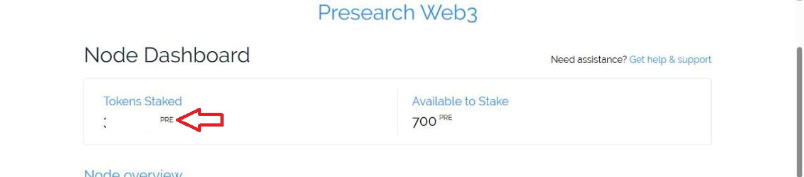<figcaption></figcaption></figure>

<figure>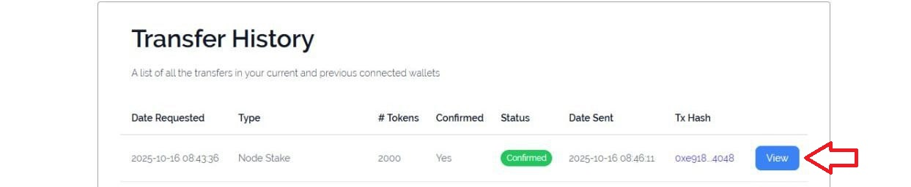<figcaption></figcaption></figure>

## Unstake Search Stake

1. On your web3 dashboard Click on Visit Dashboard within **Node Stake Balance.**

<figure><figcaption></figcaption></figure>

2. Scroll down to the **¨Current Nodes¨** section and click on stake.

<figure><figcaption></figcaption></figure>

3. Enter the Stake amount manually or set it to 0 if you want to withdraw all the Pre from the node and click Update Stake.

<figure>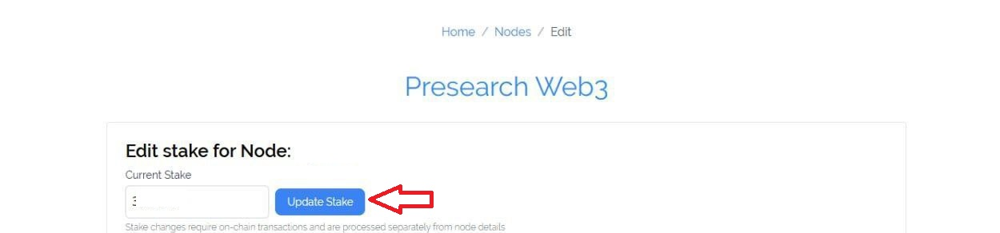<figcaption></figcaption></figure>

4. Click on Unstake.

<figure>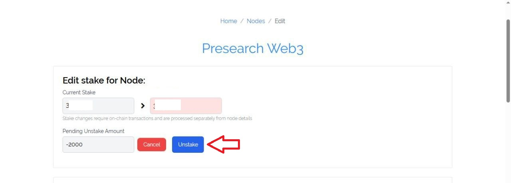<figcaption></figcaption></figure>

5. Confirm the transaction and you will have the tokens inside your external wallet.

<figure>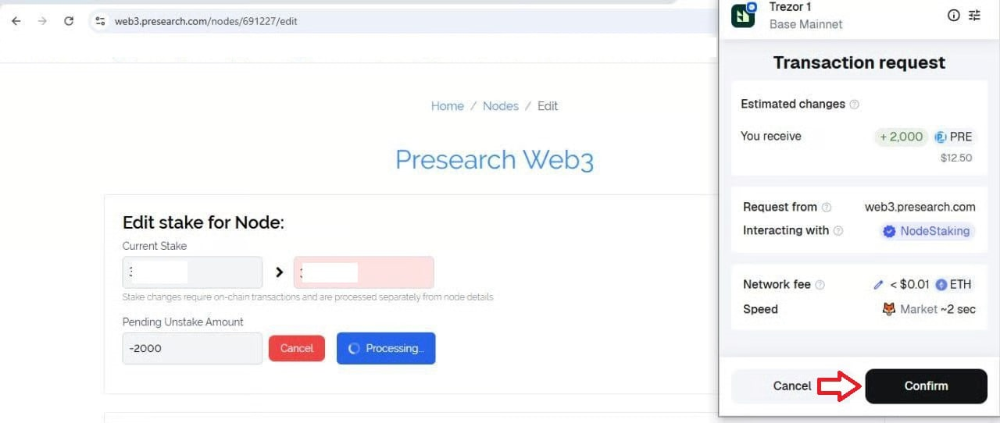<figcaption></figcaption></figure>

6. You will be able to see that it has been successfully Unstake and you will also be able to see it in the transaction history.

<figure>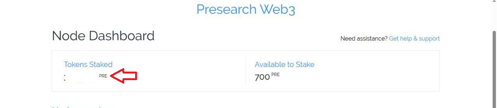<figcaption></figcaption></figure>

<figure>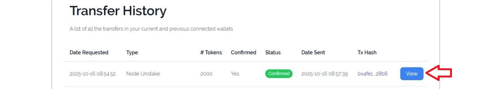<figcaption></figcaption></figure>

### Youtube link 

Node Staking in Web3 Made Easy | Presearch’s Step-by-Step Guide.



 
