# How to Search Stake on Presearch Web3

1. Log in to your [presearch account](https://presearch.com/), you can follow the tutorial here: [Presearch Web3 Login](presearch-web3-login.md)
2. Enter your account menu: [My Account](https://account.presearch.com/) and click on Web3 dashboard.

<figure><figcaption></figcaption></figure>

3. Click on Visit Dashboard within **Search Stake Balance.**

<figure>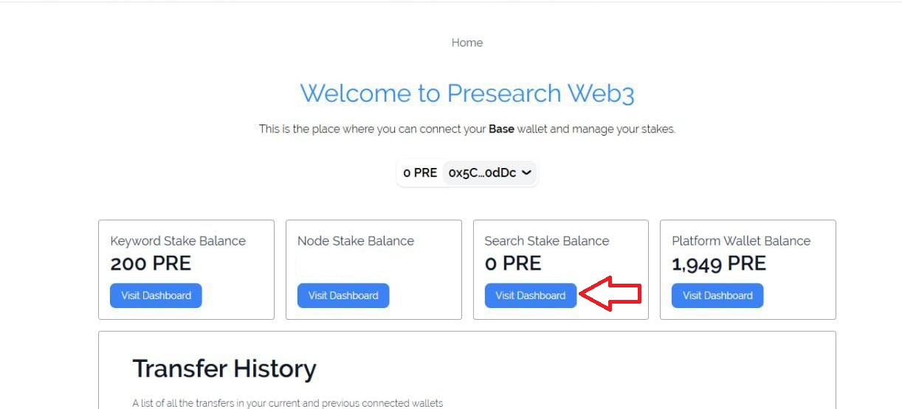<figcaption></figcaption></figure>

4. Click on Update Stake.

<figure>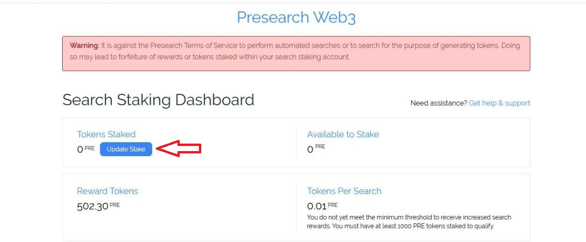<figcaption></figcaption></figure>

5. Enter the Stake amount and then click Update Stake.

<figure>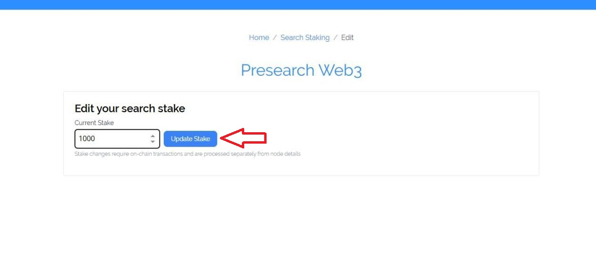<figcaption></figcaption></figure>

6. Approve the transaction and then confirm it in your external wallet.

<figure>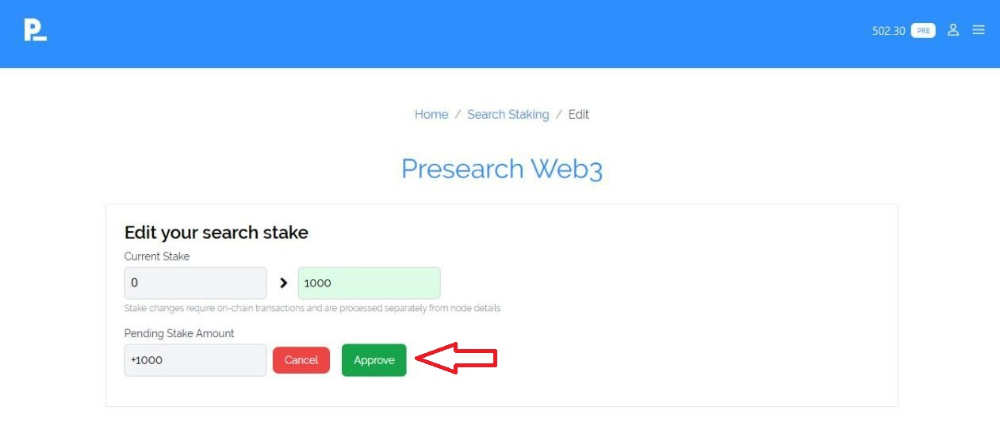<figcaption></figcaption></figure>

<figure>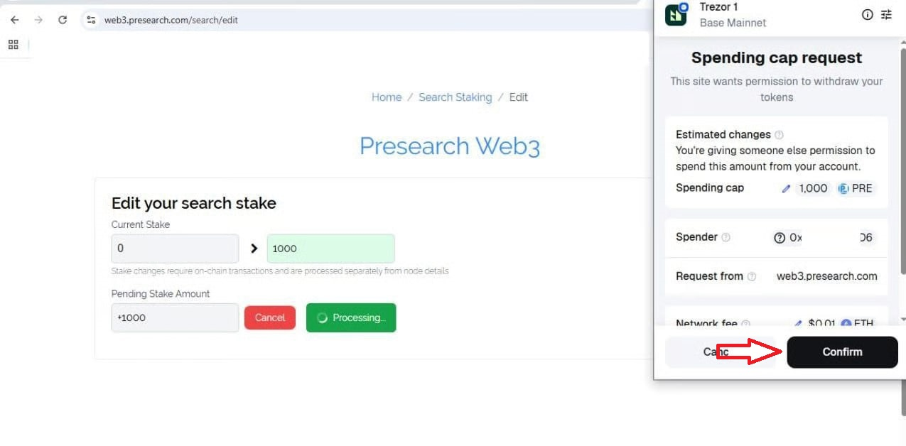<figcaption></figcaption></figure>

<figure><figcaption></figcaption></figure>

7. You will now be able to see the PRE stake on your **Search Staking Dashboard** and you will also be able to see it in **Transfer History.**

<figure>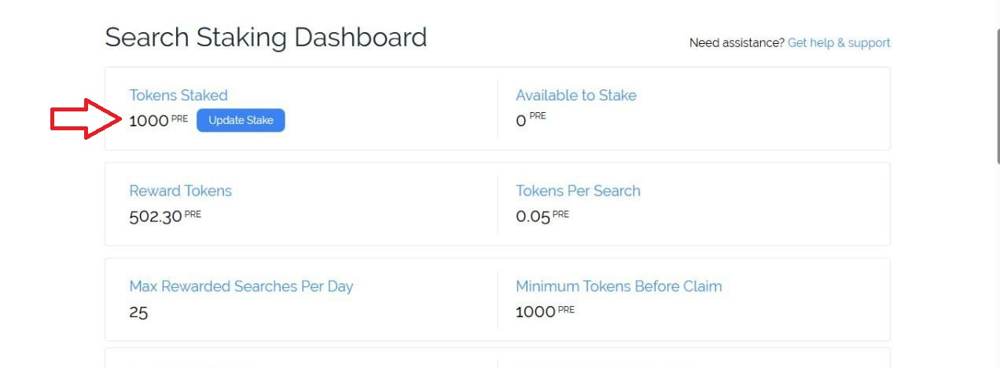<figcaption></figcaption></figure>

<figure>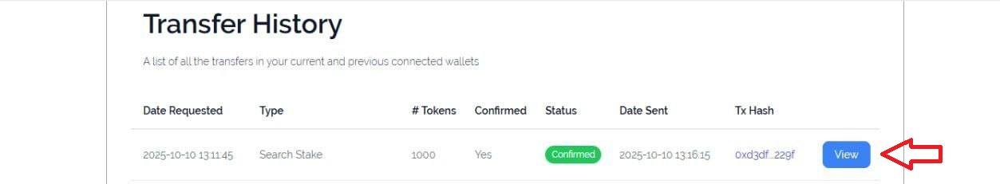<figcaption></figcaption></figure>

## Unstake Search Stake

1. On your web3 dashboard Click on Visit Dashboard within  **Search Stake Balance.**

<figure>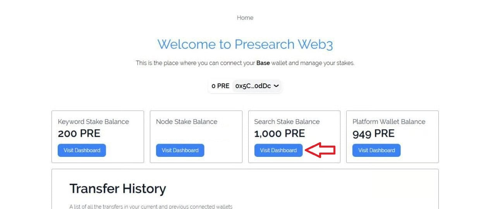<figcaption></figcaption></figure>

2. Click on Update Stake.

<figure>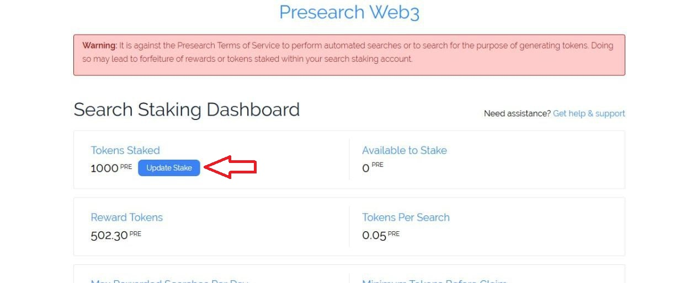<figcaption></figcaption></figure>

3. Enter 0 and then click Update Stake.

<figure>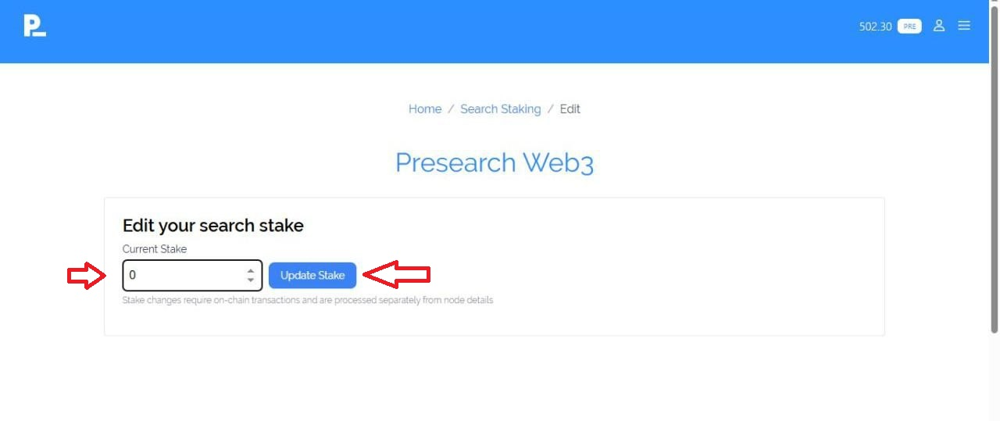<figcaption></figcaption></figure>

4. Click on Unstake.

<figure><figcaption></figcaption></figure>

5. Confirm the transaction and you will have the tokens inside your external wallet.

<figure>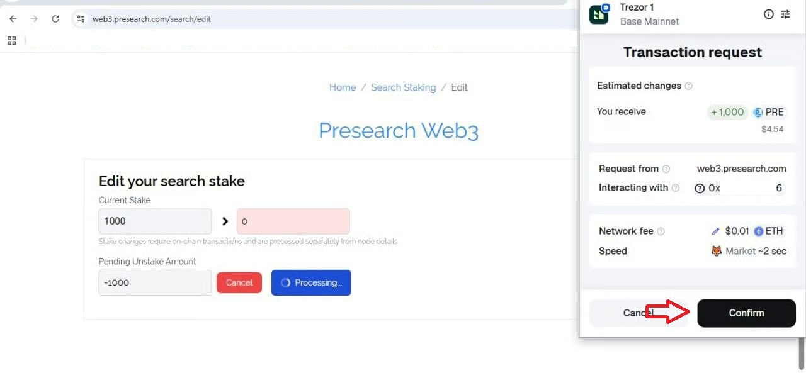<figcaption></figcaption></figure>

6. You will be able to see that it has been successfully Unstake and you will also be able to see it in the transaction history.

<figure>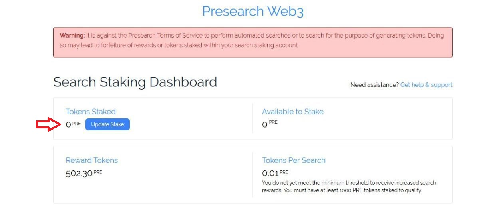<figcaption></figcaption></figure>

<figure><figcaption></figcaption></figure>

### Youtube link 

The More You Stake, The More You Earn | Presearch Search Staking Tutorial.


