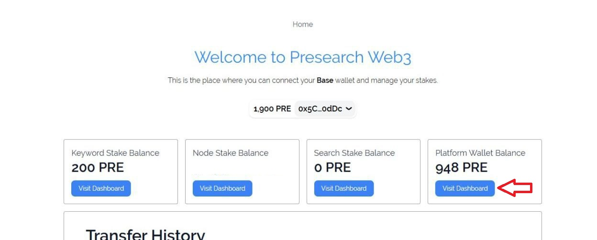
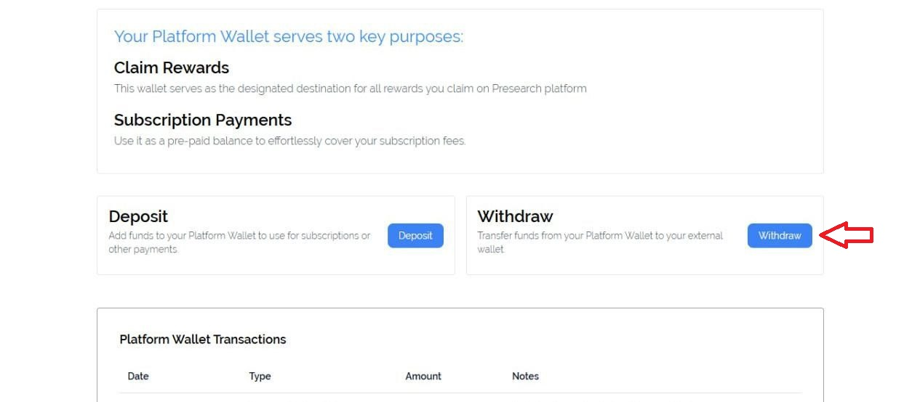
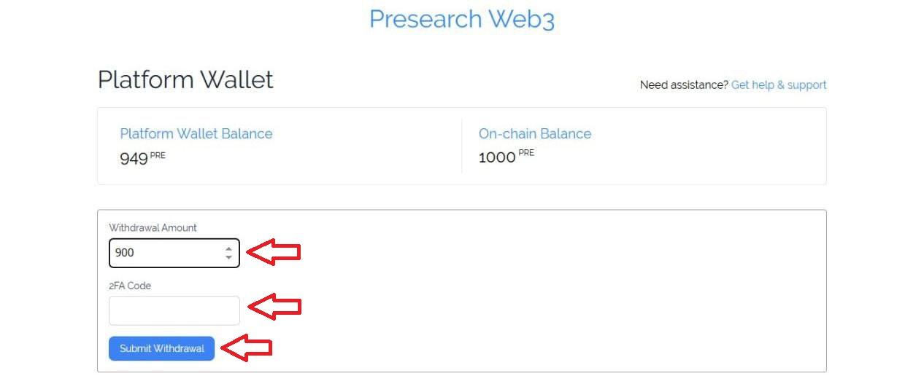
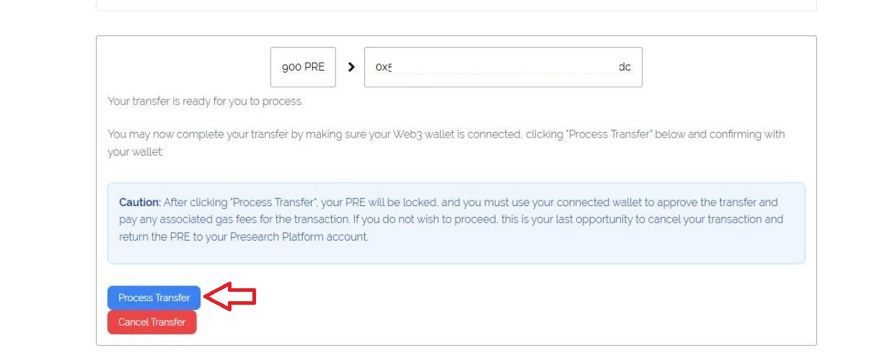
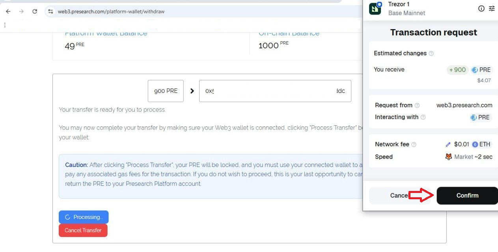
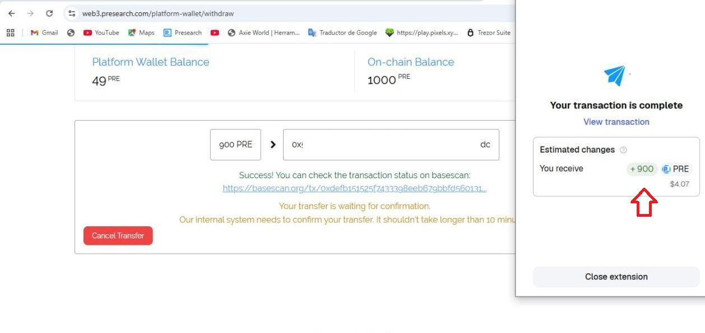
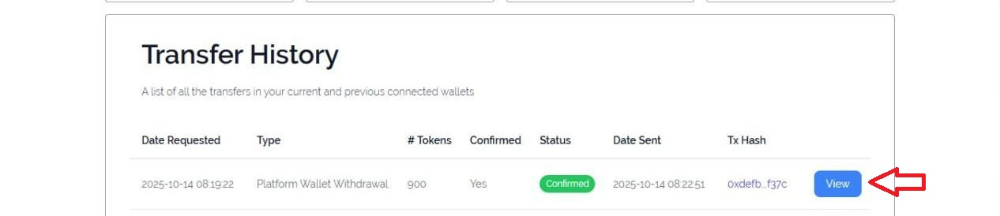

# How to withdraw tokens on the Presearch Web3 platform

1. Log in to your [presearch account](https://presearch.com/), you can follow the tutorial here: [Presearch Web3 Login](presearch-web3-login.md)
2. Enter your account menu: [My Account](https://account.presearch.com/) and click on Web3 dashboard.

<figure><figcaption></figcaption></figure>

3. Click on Visit Dashboard within the Platform Wallet Balance.

<figure><figcaption></figcaption></figure>

4. Click on withdraw.

<figure><figcaption></figcaption></figure>

5. Enter the amount of Pre to withdraw, the 2FA code of your Presearch account and then click submit withdrawal.

<figure><figcaption></figcaption></figure>

6. Click on process transfer.

<figure><figcaption></figcaption></figure>

7. Confirm the transaction in your external wallet.

<figure><figcaption></figcaption></figure>

8. Once the transaction is confirmed, you will have the tokens in your wallet and you can also verify it in the transfer history.

<figure><figcaption></figcaption></figure>

<figure><figcaption></figcaption></figure>
