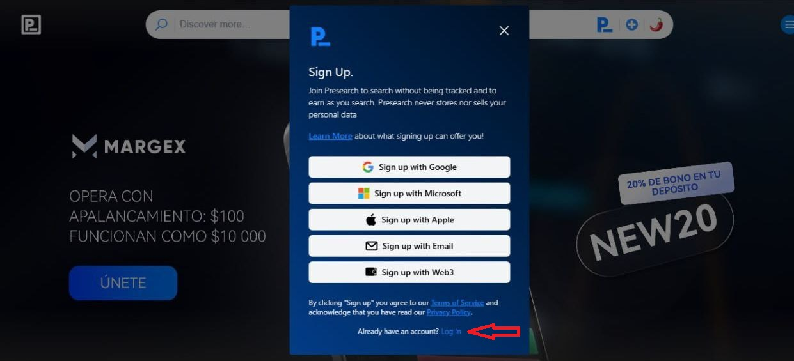
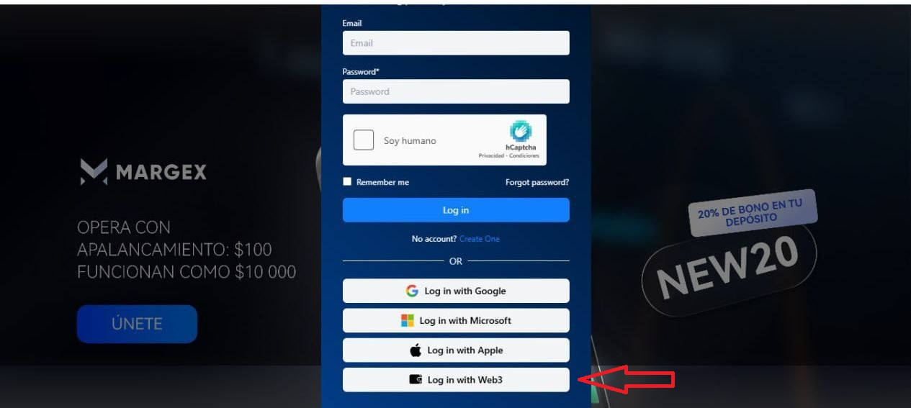
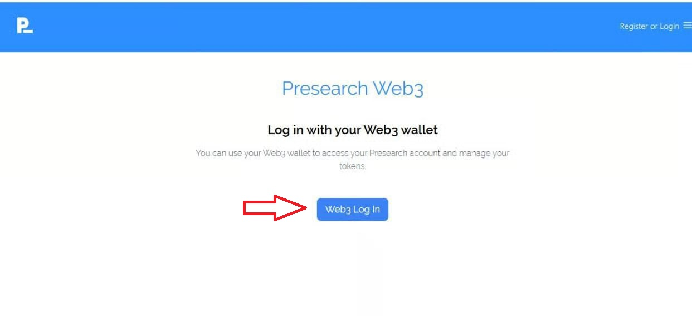
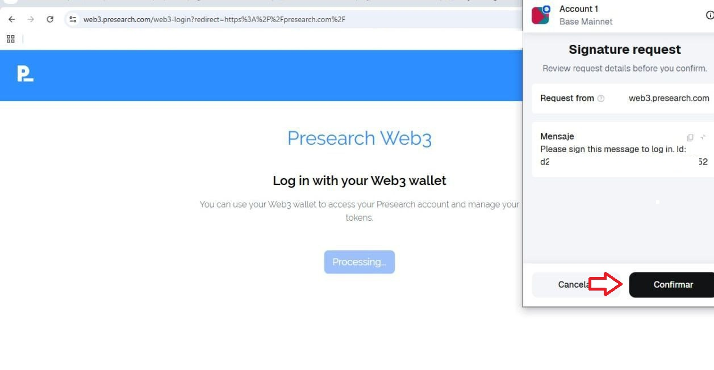
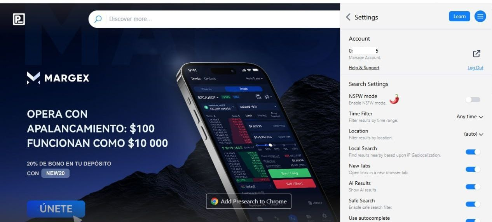
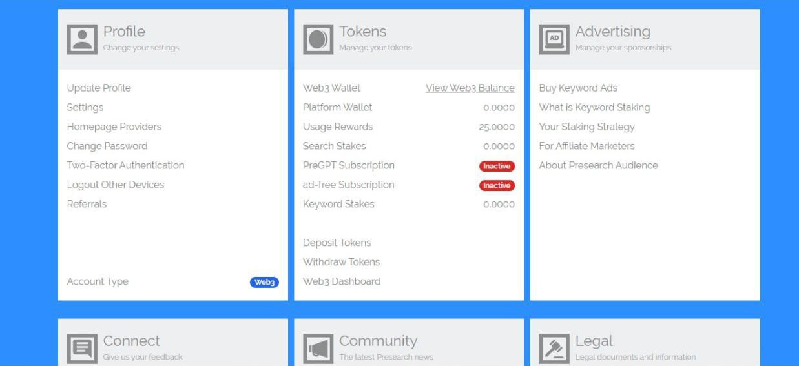

# Presearch Web3 Login

1. Go to [presearch.com](https://presearch.com/)
2. Click on the hamburger menu in the top right corner of the page.

<figure><figcaption></figcaption></figure>

3. Click on sing in Sing In | Create Account / Sign into Your Account.

<figure><figcaption></figcaption></figure>

4. Enter Log In.

<figure><figcaption></figcaption></figure>

5. Log in with Web3.

<figure><figcaption></figcaption></figure>

6. Click on Web3 Log in

<figure><figcaption></figcaption></figure>

7. Sign the external wallet login request by clicking the confirm button.

<figure><figcaption></figcaption></figure>

8. Once you have connected your external wallet via Web3, you will be logged into your Presearch account.

<figure><figcaption></figcaption></figure>

<figure><figcaption></figcaption></figure>

## Youtube link

Presearch Web3 Login Tutorial | Step-by-Step Guide


