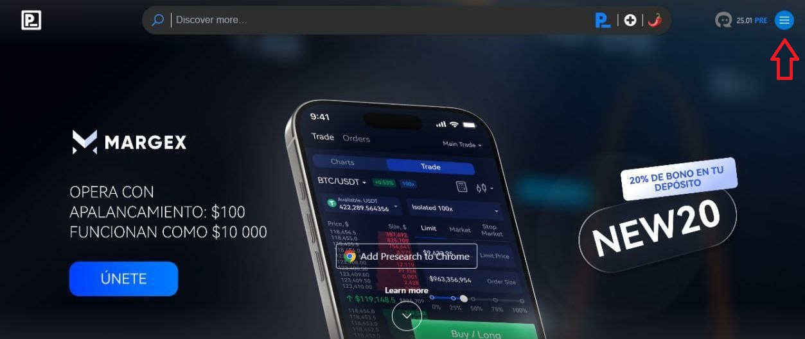
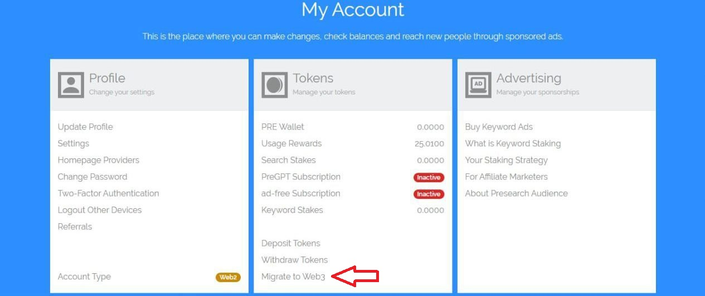
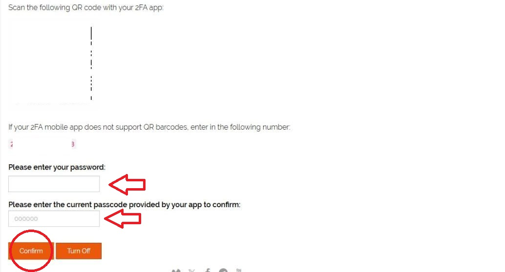
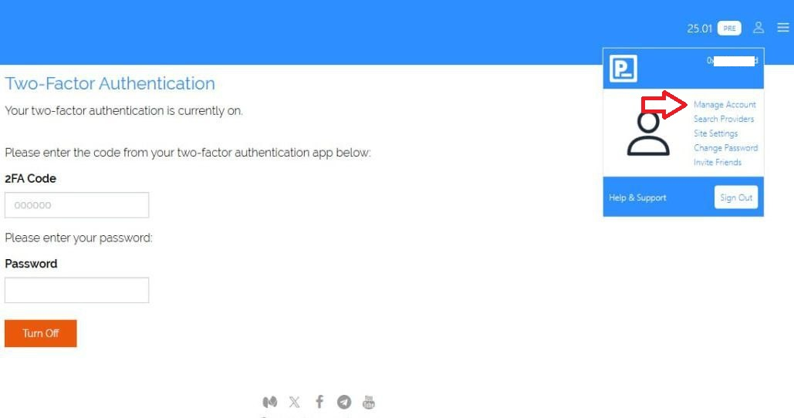
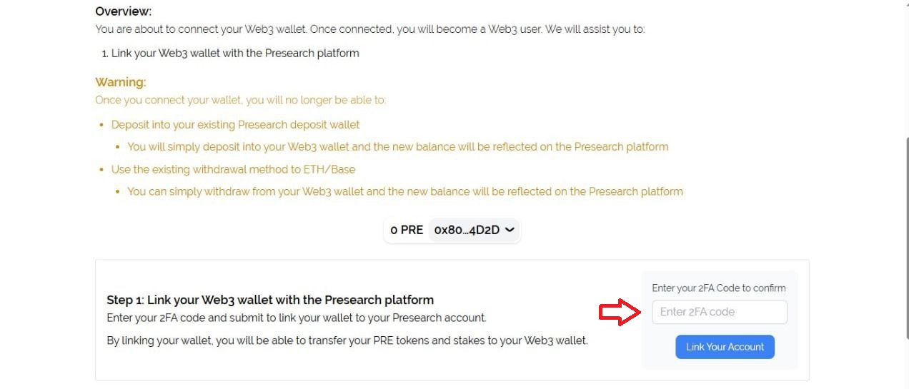
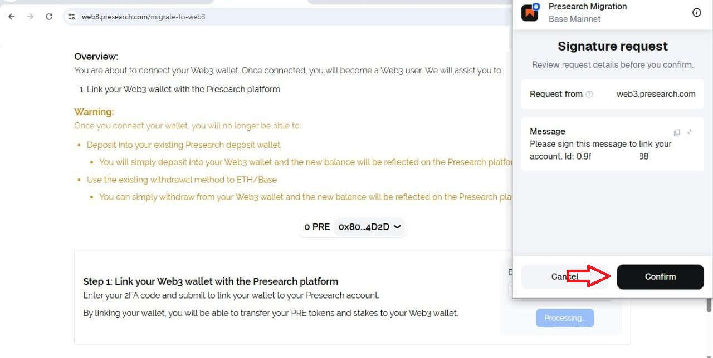
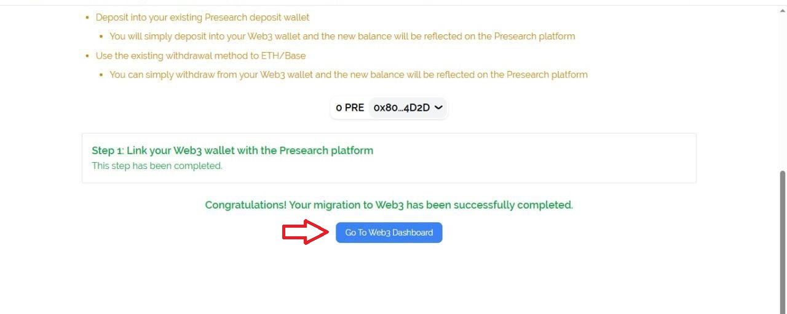
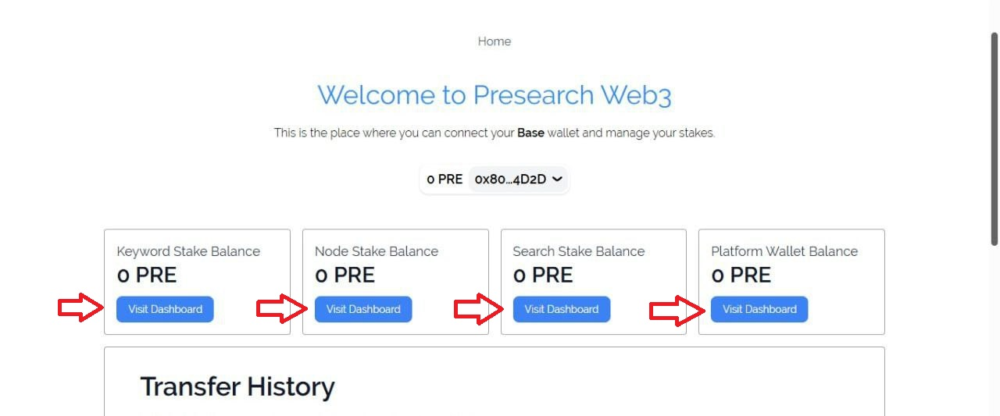

# Presearch Web3 Migration

1. Go to [presearch.com](https://presearch.com) and log in to your account.
2. Open the hamburger menu.

<figure><figcaption></figcaption></figure>

3. Click on manage account.

<figure><figcaption></figcaption></figure>

4. Scroll down to the Tokens section and select web3 dashboard.

<figure><figcaption></figcaption></figure>

5. At this stage, you'll need to activate two-factor authentication. Enter your code and password and press Confirm. If you don't have it activated, you can do so [here](https://account.presearch.com/privacy-settings).

<figure><figcaption></figcaption></figure>

6. Click on your profile icon in the top right corner and return to manage.

<figure><figcaption></figcaption></figure>

7. From there, go back to the Tokens menu and click on Web3 again.

<figure><figcaption></figcaption></figure>

8. Scroll down to step one, enter your two-factor authentication code to link your wallet to your Presearch account.

<figure><figcaption></figcaption></figure>

9. Click on link your account and complete the authentication required by your wallet.

<figure><figcaption></figcaption></figure>

10. Once this is done, your migration to Web3 will be complete. You have now successfully migrated your account to Presearch Web3 and you can click **Go to Web3 Dashboard** to see your account balances.

<figure><figcaption></figcaption></figure>

11. Here you can see the Presearch Web3 dashboard and the balances of Keyword Stake, Node Stake, Search Stake, and your platform wallet.

<figure><figcaption></figcaption></figure>

## Youtube link

Presearch Web3 Migration Tutorial | Step-by-Step Guide

**Note: This tutorial is applicable for many users who have no PRE balance, no stakes, and no wallet funds.**



&#x20;In this other video you can see the procedure for migrating Keyword Stake, Node Stake and Search Stake, once you complete step 1 and link your wallet with Presearch Web3, proceed to step 2: **Transfer your tokens from your presearch platform balance (not any stakes) to your connected wallet**, accept the terms and conditions and confirm the transfer.

&#x20;Then transfer each of the Stake (Keywords, Nodes, Search) which you must place your 2Fa code and sign the transaction in your wallet., now all your Pre balance is now migrated to Web3 and you will be able to see it on your [dashboard](https://web3.presearch.com/platform-wallet).

## Youtube link

Web3 (Keyword Stake, Node Stake, Search Stake) Migration Made Easy on Presearch: Step-by-Step Guide.



\

\
