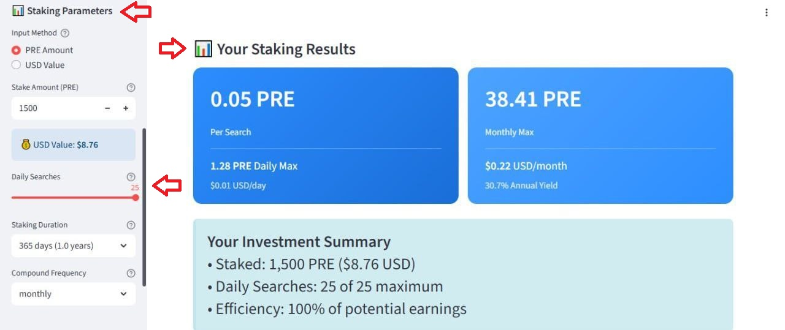
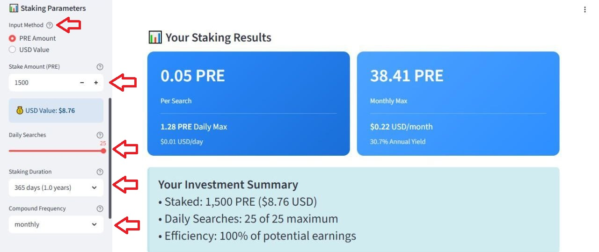
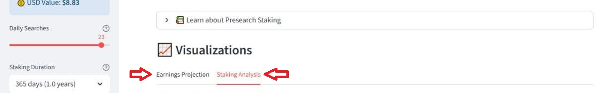

# How to use the calculator for Search Stake

The first thing you need to do to use the calculator for Search Stake is go to [https://presearchstakingcalc.replit.app](https://presearchstakingcalc.replit.app)

1. When you enter the link you will see the following screen:

<figure><figcaption></figcaption></figure>

2. Scroll down (📊 Your Staking Results) and also scroll down the menu bar on the left side of the screen (📊 Staking Parameters).

<figure><figcaption></figcaption></figure>

3. Enter the Input Method: Pre amount or USD value.

* Stake Amount (PRE)
* Daily Searches
* Staking Duration
*   Compound Frequency

    \
    And the results will be adjusted depending on the parameters set.

<figure><figcaption></figcaption></figure>

4. Finally, you can see a graph of the earnings projection of the Pre rewards and a staking analysis of earned Pre per day.

<figure><figcaption></figcaption></figure>

<figure><figcaption></figcaption></figure>

<figure><figcaption></figcaption></figure>
